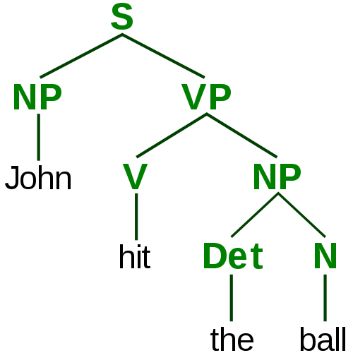
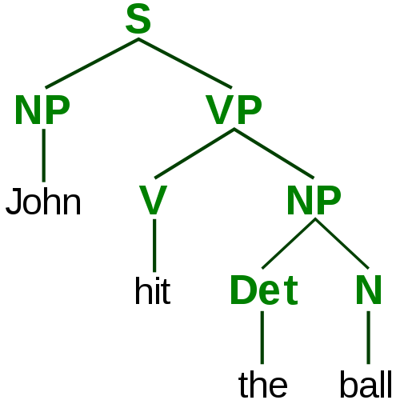
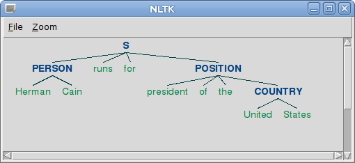
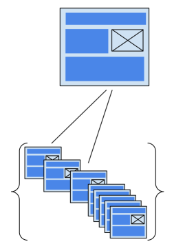

.. include:: <s5defs.txt>

===========================
Just Enough NLP with Python
===========================

:Author:  Andrew Montalenti
:Date:    $Date: 2011-10-23 09:00:00 -0500 (Tues, 23 Oct) $

.. This document is copyright Andrew Montalenti and Parsely, Inc.

.. container:: handout

    **How this was made**

    This document was created using Docutils_/reStructuredText_ and S5_.

    It is the introductory NLP course given by Parsely, Inc. to
    the newest generation of Python hackers.

    Simplicity begets elegance.

.. _Docutils: http://docutils.sourceforge.net/
.. _reStructuredText: http://docutils.sourceforge.net/rst.html
.. _S5: http://meyerweb.com/eric/tools/s5/

Meta Information
----------------

**Me**: I've been using Python for 10 years. I use Python full-time, and have for the last 3 years. I'm the founder/principal at `Aleph Point`_, an agile software engineering consulting and training firm. I'm co-founder/CTO of Parse.ly_, a tech startup in the digital media space.

**E-mail me**: andrew@parsely.com

**Follow me on Twitter**: amontalenti_

**Connect on LinkedIn**: http://linkedin.com/in/andrewmontalenti

.. _Aleph Point: http://alephpoint.com
.. _Parse.ly: http://parsely.com
.. _amontalenti: http://twitter.com/amontalenti

Slide Zero
-----------

Simplicity begets elegance.

NLTK Hello, World
-----------------

.. sourcecode:: python

    >>> import nltk
    >>> msg = "Hello, World!"
    >>> nltk.wordpunct_tokenize(msg)
    ['Hello', ',', 'World', '!']

Why is NLTK a Pythonic library?
-------------------------------

.. sourcecode:: python

    >>> len(dir(nltk))
    355
    >>> fd = inspect_module(nltk)
    >>> fd.items()
    [('class', 172), ('function', 107), ('module', 48), ('other', 28)]

Here's inspect_module for reference
-----------------------------------

.. sourcecode:: python

    import nltk
    import inspect

    def inspect_module(module):
        fd = nltk.FreqDist()
        inspections = ["function", "module", "class"]
        for item in vars(module).itervalues():
            matched = False
            for inspection in inspections:
                if getattr(inspect, "is%s" % inspection)(item):
                    matched = True
                    fd.inc(inspection)
            if not matched:
                fd.inc("other")
        return fd

Batteries Included
------------------

With more than 100 classes and 100 functions in the root ``nltk`` module, nltk certain adheres to "flat is better than nested"

However, in the best Pythonic style, the flattened namespace is also neatly organized into nearly 48 submodules, of which many contain sub-sub-modules. Therefore, it also respects "namespaces are one honking great idea"

Practicality beats purity
-------------------------

Although NLTK is, in name, a "natural language toolkit", it also includes some generally useful modules that are notably missing from Python Stdlib.

I've already used one of these, ``nltk.FreqDist``, which is a generic and Python "frequency distribution" class. It is actually ``dict``-like, which means it supports the full dictionary protocol, but adds a few more functions.

The keys are labels and values are integers representing number of occurrences of each supplied label. You increment labels with ``fd.inc()``.

Practicality: HTML cleaning
----------------------------

``nltk.clean_html`` is a nice HTML-stripping function.

.. sourcecode:: python

    >>> nltk.clean_html("""
        
This is some article text 
        with <a href='http://google.com'>
        a link to Google</a>
""")
    'This is some article text with a link to Google'    

Practicality: Tree data structure
---------------------------------

.. class:: incremental

    ``nltk.Tree`` is a powerful abstraction for grouping trees and subtrees.

    Each ``Tree`` contains leaves and subtrees. Leaves are simply literal values, but subtrees are treated specially.

    Further, trees can have arbitrary node properties. Finally, ``Tree`` instances can be constructed either using Python procedural code or a simple text DSL implemented by the ``Tree.parse`` class method.

Syntax parse tree example
--------------------------

.. class:: incremental

    John hit the ball.

    JOHN hit the ball.

    john HIT the ball.

    john hit THE BALL.

Syntax parse tree example
--------------------------

Syntax parse tree example
--------------------------

Tree example: parsing
---------------------

.. sourcecode:: python

    >>> Tree.parse("""
    (S 
        (PERSON Herman Cain) 
        runs for 
        (POSITION president of the 
            (COUNTRY United States)
        )
    )""")
     Tree('S', [Tree('PERSON', ['Herman', 'Cain']), 'runs', ...

Tree example: printing
----------------------

.. sourcecode:: plain

    >>> print tree.pprint(margin=40, nodesep=" ->", parens=["", ""])
    S ->
        PERSON -> Herman Cain
        runs
        for
        POSITION ->
            president
            of
            the
            COUNTRY -> United States

Tree example: drawing!
----------------------

.. sourcecode:: python

    >>> tree.draw()

A taste of what's to come
-------------------------

.. sourcecode:: python

    >>> tree = entities("""Hermain Cain runs for 
    president of the United States""")
    >>> print tree.pprint(margin=40, nodesep=" ->", parens=["", ""])
    S ->
        NE -> Herman/NNP Cain/NNP
        runs/VBZ
        for/IN
        president/NN
        of/IN
        the/DT
        NE -> United/NNP States/NNPS

Text and TextCollection
------------------------

.. class:: incremental

    One last set of data structures to be aware of are implemented in the ``nltk.Text`` and ``nltk.TextCollection`` classes.

    A ``Text`` is nothing more than an in-memory data structure of a variety of a collection of tokens, with the ability to do quick text analyses such as term frequency, collocation, similarity, and simple regex-based searching.

    A ``TextCollection`` is a grouping of ``Text`` instances that allows you to do corpus-wide calculations (such as term frequency, inverse document frequency, and yes, tf/idf!)

Text example
------------

.. sourcecode:: python

    >>> t1 = nltk.Text(nltk.word_tokenize("""
        Barack Obama is president of the 
        United States. Mr. Obama was elected 
        in 2008."""))
    >>> t1.count("Obama")
    2

TextCollection example (1)
--------------------------

.. sourcecode:: python

    >>> t2 = nltk.Text(nltk.word_tokenize("""
        Barack Obama is giving a speech on Iraq tomorrow"""))
    >>> t3 = nltk.Text(nltk.word_tokenize("""
        Barack Obama's speech illustrates the 
        president's goal to leave Iraq"""))
    >>> col = nltk.TextCollection([t1, t2, t3]) 

TextCollection example (2)
--------------------------

.. sourcecode:: python

    >>> col.vocab().items()[0:4]
    [('Obama', 4), ('Barack', 3), ("'s", 2), ('Iraq', 2)]
    >>> col.tf("Barack", t1)
    0.066666666666666666
    >>> col.tf("Obama", t1)
    0.13333333333333333
    >>> col.idf("Obama")
    0.0
    >>> col.idf("Iraq")
    0.40546510810816438
    >>> col.tf_idf("Obama", t1)
    0.0
    >>> col.tf_idf("Iraq", t2)
    0.045051678678684932
    >>> col.collocations()
    Barack Obama

Quick note on Text/TextCollection
---------------------------------

Though these classes are good for illustration purposes, I find this to be one of the less polished parts of NLTK.

For more formal support for texts and text collections, one should use Solr in production. I've considered experimenting with Whoosh (basically, "a Solr in Python," but simpler/less scalable) but never found a good reason to avoid simply loading text documents into Solr.

Rule vs. Data-based Corpus Linguistics
--------------------------------------

Part of the principle behind NLTK is that 100% rule-based language processing has failed to produce the results necessary for large-scale NLP needs.

NLTK's approach is to take the best of the rule-based world (parse trees, syntactic decomposition, tagging) and combine it with the lessons learned by the information retrieval community. That is, often data can inform models better than cleverness.

Practicality wins again: nltk.data
-----------------------------------

The ``nltk.data`` module offers access to a slew of off-the-shelf models that are widely used in academia, and is extensible so that you can add your own. The data tends to be stored in high-speed disk indexes (e.g. cPickle files) so that performance is acceptable as long as fast I/O is available.

On the NLTK menu (1)
--------------------

So, we have seen that NLTK provides some basic utilities that will likely make NLP easier, such as trees and statistical data structures. What else does NLTK offer?

Much more than you might expect. Here are some highlights:

.. class:: incremental

    * ``nltk.tokenize``: a variety of tokenizers using fast, rule-based algorithms. These are familiar to users of Lucene/Solr -- there are implementations here of e.g. Punkt, Treebank, and simpler approaches.
    * ``nltk.stem``: a variety of stemmers using rule-based and data-based algorithms. You'll find familiar ones like Porter and Snowball here

On the NLTK menu (2)
--------------------

The following modules are really the core of NLTK:

.. class:: incremental

    * ``nltk.grammar``: support for context-free grammars (CFGs) which are used in many rule-based systems. Interestingly, CFGs are very much used in computer science theory and programming language design.
    * ``nltk.tag``: after tokenizing text, you may want to annotate it with metadata that helps with understanding (such as parts of speech). The tag module is solely focused on this task, with classes that help with tagging and retagging tokens, such as Brill and Regexp based taggers.
    * ``nltk.chunk``: after tagging text, you may find it appropriate to "chunk" the text in order to gain meaning beyond the single-word level. This is particularly handy in information extraction / entity identification.

On the NLTK menu (3)
--------------------

Finally, NLTK provides some modules that go beyond actually processing text and onto analyzing large amounts of text for meaning. These include:

.. class:: incremental

    * ``nltk.classify``: offers feature-based classifiers such as ``NaiveBayesClassifier`` and ``MaxEntClassifier``. These are not highly scalable implementaitons, but they are good enough for testing hypotheses and could be made to scale if needed.
    * ``nltk.cluster``: offers standard algorithms for grouping documents using e.g. the vector space model, k-means, and ways of visualizing these clusters.

On the NLTK menu (4)
--------------------

.. class:: incremental

    * ``nltk.collocations``: offers simple finders for ngram collocations, e.g. Barack occurs-frequently-with Obama
    * ``nltk.featstruct``: provides data structures for representing "features" of parsed language constructs. This is often used for "second-pass" filtering of noisy parts of your model.
    * ``nltk.corpus.reader.wordnet``: a simple wrapper for the powerful Wordnet dictionary/thesaurus.

Other options for Python NLP exist
----------------------------------

    * http://www.clips.ua.ac.be/pages/pattern-en
    * http://pypi.python.org/pypi/stemming/1.0
    * https://github.com/apresta/tagger
    * http://pypi.python.org/pypi/Whoosh/
    * http://github.com/japerk/nltk-trainer

And other options for NLP generally exist
-----------------------------------------

    * http://mahout.apache.org/
    * http://incubator.apache.org/opennlp/
    * http://mallet.cs.umass.edu/
    * http://www.cs.waikato.ac.nz/ml/weka/
    * http://alias-i.com/lingpipe/

Brief Interlude for Questions?
------------------------------

Next, we dive into doing entity extraction with NLTK. Any questions for now?

NLTK has a default NER algorithm
-----------------------------------------

.. sourcecode:: python

    from nltk import ne_chunk, pos_tag, word_tokenize

    def entities(text):
        ne_chunk(
            pos_tag(
                word_tokenize(text)))

    >>> print entities("Steve Jobs created our Apple iPads").pprint()
    (S
        (PERSON Steve/NNP)
        (PERSON Jobs/NNP)
        created/VBD
        our/PRP$
        shiny/NN
        (PERSON Apple/NNP iPads/NNP))

Good NER is hard
-----------------

So, despite this system's fancy model, including a whole lot of gold-standard data, it still managed to make some mistakes. It considered "Steve" and "Jobs" to be two different people, and it wrongly considered "Apple iPads" to be a person.

However, perhaps it is being too ambitious? Can we make it detect "entities" regardless of whether they are geographic regions, people, or other classifications? Yes!

Binary NER
----------

Binary NER is a simpler problem than "traditional" NER, though still hard.

.. sourcecode:: python

    def entities(text):
        chunks = \
            ne_chunk(
                pos_tag(
                    word_tokenize(text)),
            binary=True) # binary only enables one type, "NE"
        return chunks

    >>> print entities("Steve Jobs created our Apple iPads").pprint()
    (S
        (NE Steve/NNP Jobs/NNP)
        created/VBD
        our/PRP$
        shiny/NN
        Apple/NNP
        iPads/NNP)

Better, but still not perfect
-----------------------------

This time, Steve Jobs was properly identified as an entity, but the binary 
extractor did not pick up on Apple iPad.

However, let's think about language a bit. Our trained part-of-speech tagger didn't have a hard time detecting the proper nouns in the sentence. "Apple" and "iPad" were both considered proper nouns, just like "Steve" and "Jobs".

For an inclusive NE chunker, wouldn't we be well off to simply treat any proper nouns as entities? We can model this decision with NLTK.

RegexpParser for proper nouns
------------------------------

.. sourcecode:: python

    from nltk import RegexpParser

    chunker = RegexpParser("""
    NAME:
        {<NNP>+}
    """)

    >>> parsed = chunker.parse(pos_tag(word_tokenize("...")))
    >>> print parsed.pprint()
    (S
        (NAME Steve/NNP Jobs/NNP)
        created/VBD
        our/PRP$
        shiny/NN
        (NAME Apple/NNP iPads/NNP)
    )

There we go!

On the right track
------------------

Perhaps we can do a combination of traditional NER and syntax rules?

Add a small show method to help
--------------------------------

First, let's make the data easier to inspect.

.. sourcecode:: python

    def text2tree(text):
        chunks = \
            ne_chunk(
                pos_tag(
                    word_tokenize(text)),
            binary=True) # binary only enables one type, "NE"
        # I don't normally do this, but it'll help :)
        def show(self):
            return self.pprint(margin=40, nodesep=" ->", parens=["", ""])
        # MONKEY PATCH
        chunks.show = types.MethodType(show, chunks)
        return chunks

Trees become entities
----------------------

.. sourcecode:: python

    def chunk2entity(chunk):
        return ' '.join(leaf[0] for leaf in chunk.leaves())

    def tree2entities(tree):
        # set comprehension, what the fuck up!?
        entities = { 
            chunk2entity(chunk)
            for chunk in tree
            if hasattr(chunk, 'node')
        }
        # yea!
        return entities

Even easier to print
---------------------

.. sourcecode:: python

    def p(text):
        print text2tree(text).show()
    
Unigram problems illustrated (1)
--------------------------------

First names are valid named entities:

.. sourcecode:: python

    >>> p("Angelina just doesn't get Brad")
    S ->
        NE -> Angelina/NNP
        just/RB
        doesnt/VBZ
        get/VB
        NE -> Brad/NNP

Unigram problem illustrated (2)
-------------------------------

Capitalized unigrams lead all sentences:

.. sourcecode:: python

    >>> p("Expectation drops for Goldman's earnings")
    S ->
        NE -> Expectation/NN
        drops/NNS
        for/IN
        NE -> Goldman/NNP
        earnings/NNS

Unigram problems illustrated (3)
--------------------------------

Many seeming unigram entities are just things:

.. sourcecode:: python

    >>> p("Apple farms reduce output")
    S ->
        NE -> Apple/NNP
        farms/NNS
        reduce/VB
        output/NN

Contrived examples (1)
----------------------

.. sourcecode:: python

    >>> p("Brad Pitt and Angelina Jolie broken up")
    S ->
        NE -> Brad/NNP Pitt/NNP
        and/CC
        NE -> Angelina/NNP Jolie/NNP
        broken/NN
        up/IN

Contrived examples (2)
----------------------

.. sourcecode:: python

    >>> p("Barack Obama gave a speech on the Iraq War")
    S ->
        NE -> Barack/NNP Obama/NNP
        gave/VBD
        a/DT
        speech/NN
        on/IN
        the/DT
        NE -> Iraq/NNP War/NNP

Contrived examples (3)
----------------------

.. sourcecode:: python

    >>> p("Sachin Kamdar is CEO of Parsely")
    S ->
        NE -> Sachin/NNP Kamdar/NNP
        is/VBZ
        CEO/NNP
        of/IN
        NE -> Parsely/NNP

Back to reality
---------------

.. class:: incremental

    Based on these contrived examples, you could draw lots of wrong conclusions.

    It seems like we're doing a good job, but we're just getting lucky.

    Headlines (and full text) have a lot more going on than these intentionally simple sentences.

Demo time
---------

... cue music ...

Ares for improvement
---------------------

.. class:: incremental

    * Get a better POS tagger
    * Get a better chunker
    * Use bigrams, trigrams, or 4-grams
    * Choose tags to exclude/include
    * Utilize corpus information (TF/IDF)
    * Prebuild affinity indices (concordance/collocation)
    * Leverage a taxonomy (e.g. Wikipedia)
    * Tap into meta-information (categories)
    * Navigate up in conceptual understanding (hypernyms)
    * Use a search engine during NLP phase (fire boolean queries)

Single doc vs. corpus analysis
------------------------------

Baby Turtles
------------

Use your powers wisely, and always remember...

Magic Turtles!
--------------

It's turtles all the way down!

.. image:: img/magicturtle.jpg
    :align: center
